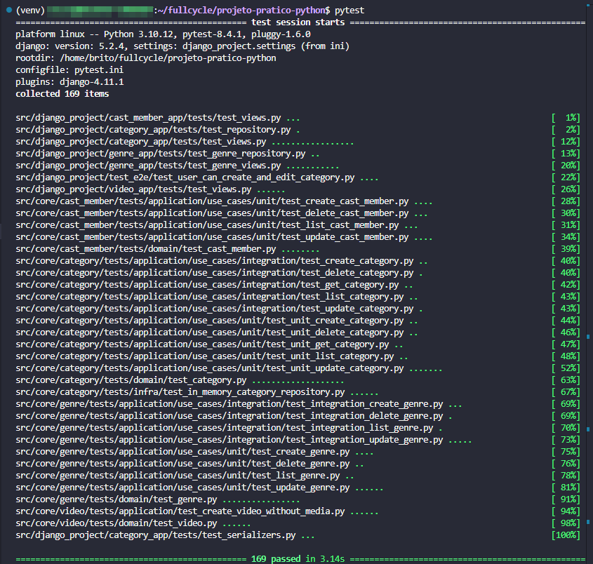

# FullCycle 3.0 back-end Python

## 1. Desafio: Implementar API para PATCH ✅

## 2. Desafio: implementar o caso de uso de atualizar gênero ✅

## 3. Desafio: Implementar API de Update para gênero ✅

## 4. Desafio: API CastMember ✅

## 5. Desafio: Paginação, refatoração e abstração ✅

## 6. Desafio: Video API

Implementar a camada de API para o use case CreateVideoWithoutMedia.

Escrever pelo menos 2 testes end-to-end

- Um para o caso de sucesso - video persistido.
- Um para o caso de falha - qualquer erro (ou múltiplos erros).

Escrever testes unitários para o usecase CreateVideoWithoutMedia

