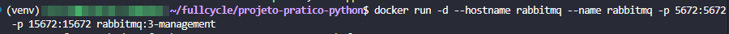
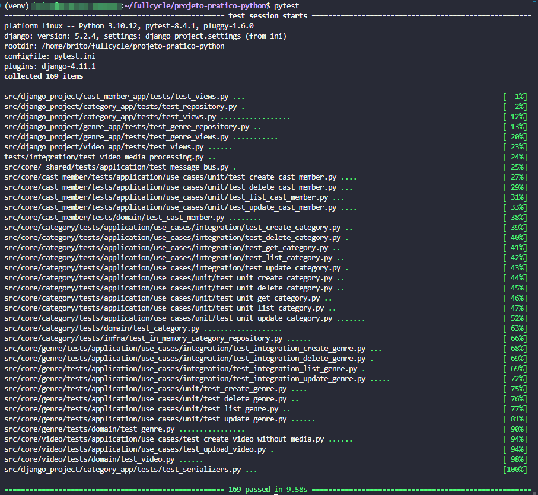
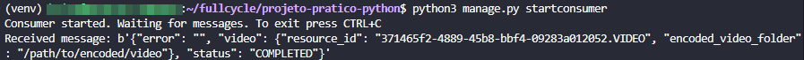

# FullCycle 3.0 back-end Python

## Instalação e Execução

### Pré-requisitos
- Python 3.10+
- pip

### Configuração do Ambiente
```bash
# Criar ambiente virtual
python3 -m venv venv

# Ativar ambiente virtual
source venv/bin/activate  # Linux/Mac
# ou
venv\Scripts\activate     # Windows

# Instalar dependências
pip install -r requirements.txt

# Aplicar migrações do Django
python manage.py migrate

# Executar testes
python -m pytest

# Iniciar servidor de desenvolvimento
python manage.py runserver
```

### APIs Disponíveis
- **Categories**: `http://localhost:8000/api/categories/`
- **Genres**: `http://localhost:8000/api/genres/`
- **Cast Members**: `http://localhost:8000/api/cast-members/`
- **Videos**: `http://localhost:8000/api/videos/`

---

## 1. Desafio: Implementar API para PATCH ✅

## 2. Desafio: implementar o caso de uso de atualizar gênero ✅

## 3. Desafio: Implementar API de Update para gênero ✅

## 4. Desafio: API CastMember ✅

## 5. Desafio: Paginação, refatoração e abstração ✅

## 6. Desafio: Video API ✅

## 7. Desafio: Teste End-to-End para Eventos

Implementar um teste end-to-end que valida todo o fluxo de processamento de mídia de vídeo através de eventos RabbitMQ.





