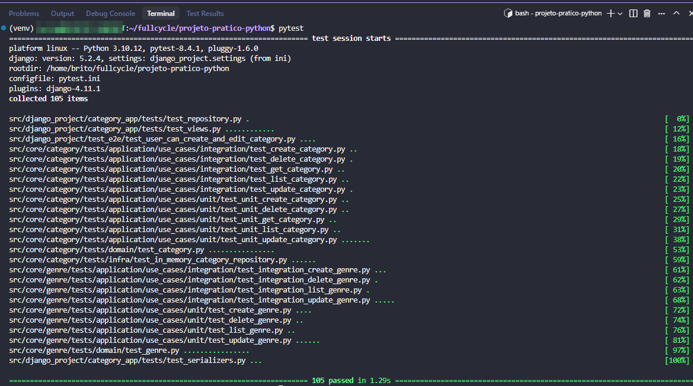

# FullCycle 3.0 back-end Python

## 1. Desafio: Implementar API para PATCH ✅

## 2. Desafio: implementar o caso de uso de atualizar gênero

Os atributos passados devem substituir totalmente os atributos da entidade (comportamento similar ao PUT e não ao PATCH).

Casos de teste (pode escolher fazer mais unitários e apenas o "happy path" de integração):

- Atualizar um Genre que não existe deve retornar um GenreNotFound Exception

- Atualizar um Genre passando atributos inválidos deve retonar uma InvalidGenre Exception

- Atualizar um Genre com categorias que não existem deve retornar um RelatedCategoriesNotFound Exception

- Atualizar um Genre com categorias que existem deve atualizar o Genre corretamente

- Incluir atributos como "name" e "is_active" no teste

