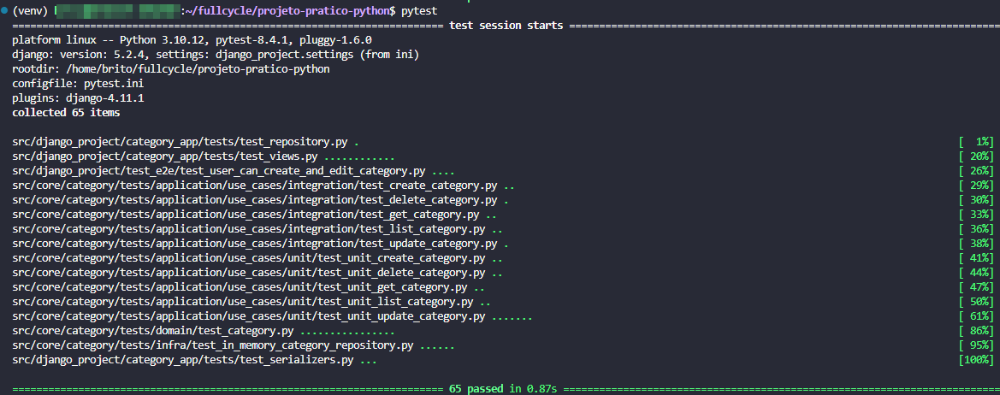

# FullCycle 3.0 back-end Python

## 1. Desafio - Implementar API para PATCH

Este desafio consiste em implementar o método PATCH na API de categorias, permitindo a atualização parcial dos campos de uma categoria (name, description, is_active). O endpoint PATCH deve aceitar qualquer combinação desses campos e atualizar apenas os valores enviados no payload.

Após implementar, execute os testes automatizados para garantir que a funcionalidade está correta.

