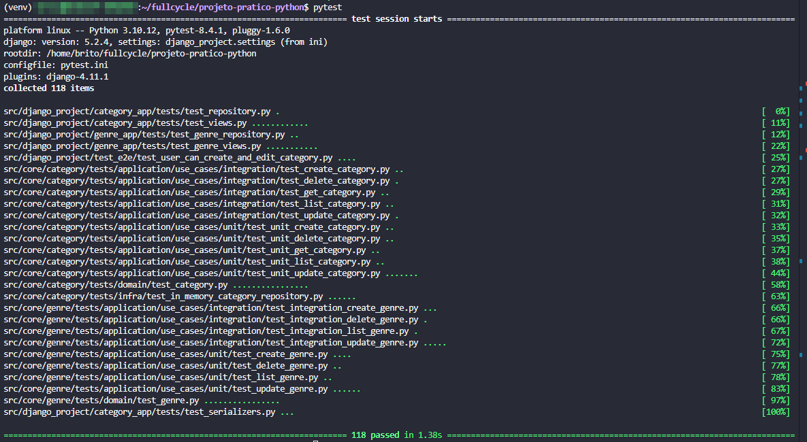

# FullCycle 3.0 back-end Python

## 1. Desafio: Implementar API para PATCH ✅

## 2. Desafio: implementar o caso de uso de atualizar gênero ✅

## 3. Implementar API de Update (PUT) com os seguintes testes

- test_when_request_data_is_valid_then_update_genre

- test_when_request_data_is_invalid_then_return_400

- test_when_related_categories_do_not_exist_then_return_400

- test_when_genre_does_not_exist_then_return_404

