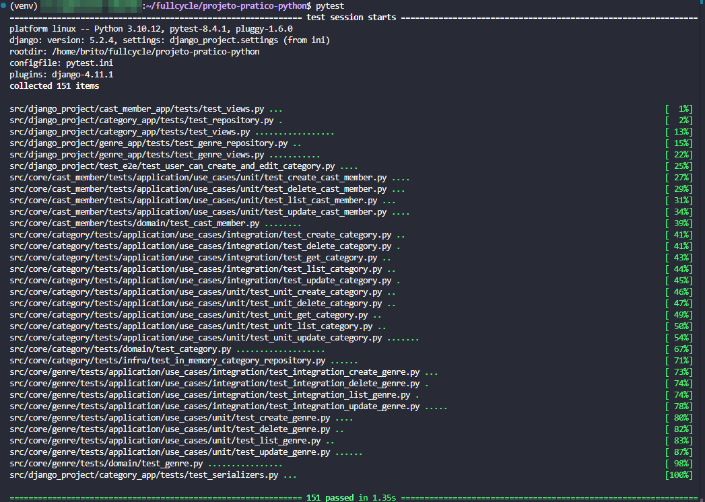

# FullCycle 3.0 back-end Python

## 1. Desafio: Implementar API para PATCH ✅

## 2. Desafio: implementar o caso de uso de atualizar gênero ✅

## 3. Desafio: Implementar API de Update para gênero ✅

## 4. Desafio: API CastMember ✅

## 5. Desafio: Paginação, refatoração e abstração

Parte 1: Adicionando paginação aos outros domínios:
A primeira parte do desafio é implementar a paginação correta para os outros 3 domínios

Parte 2: Refatoração/Abstração
Você deve ter percebido que a listagem é uma operação muito parecido entre os diferentes domínios.

Tente abstrair e diminuir a duplicação de código para a listagem de entidades, tanto para a camada de aplicação quanto para a API (Views/Serializers).

