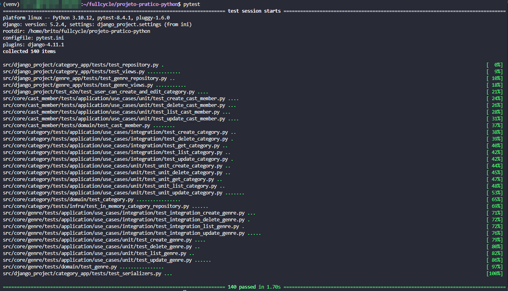

# FullCycle 3.0 back-end Python

## 1. Desafio: Implementar API para PATCH ✅

## 2. Desafio: implementar o caso de uso de atualizar gênero ✅

## 3. Desafio: Implementar API de Update para gênero ✅

## 4. Desafio: API CastMember

O objetivo deste desafio é implementar uma aplicação Django que gerencie membros de elenco de filmes ou séries, conhecidos como CastMembers.

